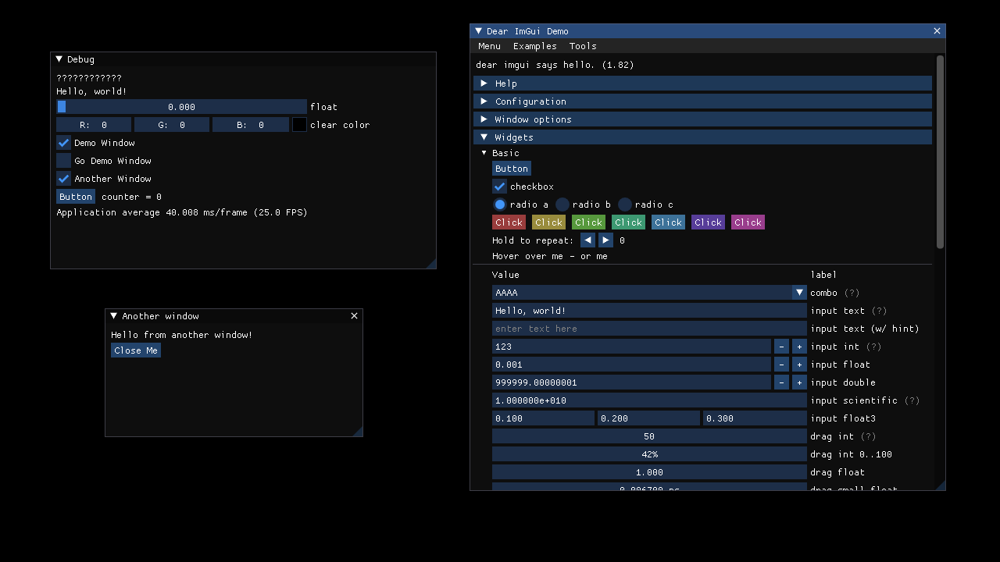

# Dear ImGui for Go

[](https://pkg.go.dev/github.com/inkyblackness/imgui-go/v2)
[](https://goreportcard.com/report/github.com/inkyblackness/imgui-go)
[](https://github.com/inkyblackness/imgui-go/actions)

This library is a [Go](https://www.golang.org) wrapper for **[Dear ImGui](https://github.com/ocornut/imgui)**.

This wrapper started as a special-purpose wrapper for use within InkyBlackness.
However, it is self-contained and can be used for other purposes as well.

This wrapper is
* hand-crafted, for Go
* documented
* versioned
* with ported examples in a separate repository (see below)



## API naming

Names of types and functions follow closely those of **Dear ImGui**.

For functions that have optional parameters, the following schema is applied:
* There is the "verbose" variant, followed by the letter `V`, such as `ButtonV(id string, size Vec2) bool`
* Next to it there is the "idiomatic" variant, without any optional parameter, such as `Button(id string) bool`.
* The idiomatic variant calls the verbose variant with the default values for the optional parameters.
Functions that don't have optional parameters don't come in a verbose variant.

The **Dear ImGui** functions `IO()` and `Style()` have been renamed to be `CurrentIO()` and `CurrentStyle()`.
This was done because their returned types have the same name, causing a name clash.
With the `Current` prefix, they also better describe what they return.  

## API philosophy
This library does not intend to export all the functions of the wrapped **Dear ImGui**. The following filter applies as a rule of thumb:
* Functions marked as "obsolete" are not available. (The corresponding C code isn't even compiled - disabled by define)
* "Shortcut" Functions, which combine language features and/or other **Dear ImGui** functions, are not available. Prime example are the Text*() functions for instance: Text formatting should be done with fmt.Sprintf(), and style formatting with the corresponding Push/Pop functions.
* Functions that are not needed by InkyBlackness are ignored. This doesn't mean that they can't be in the wrapper, they are simply not a priority. Feel free to propose an implementation or make a pull request, respecting the previous points :)

## Version philosophy
This library does not mirror the versions of the wrapped **Dear ImGui**. The semantic versioning of this wrapper is defined as:
* Major changes: (Breaking) changes in API or behaviour. Typically done through changes in **Dear ImGui**.
* Minor changes: Extensions in API. Typically done through small version increments of **Dear ImGui** and/or exposing further features in a compatible way.
* Patch changes: Bug fixes - either in the wrapper or the wrapped **Dear ImGui**, given that the API & behaviour remains the same.

At the moment, this library uses version [1.81](https://github.com/ocornut/imgui/releases/tag/v1.81) of **Dear ImGui**.

## Examples
A separate repository was created to host ported examples and reference implementations.
See repository [inkyblackness/imgui-go-examples](https://github.com/inkyblackness/imgui-go-examples).

It contains reference implementations for libraries such as [GLFW3](https://github.com/go-gl/glfw) and [SDL2](https://github.com/veandco/go-sdl2), using [OpenGL](https://github.com/go-gl/gl).

The screenshot above was created with such an example.

## Extras

### FreeType font rendering

If the `FreeType` library is available for your platform, you can enable using it with the build tag `imguifreetype` - as in
```
go build -tags="imguifreetype"
```
This extra is based on the reference implementation from **Dear ImGui**.

If you set the build tag, yet the corresponding support has not been added to the library, you will receive a build error.
Contributions to support more build environments are happily accepted. See file `FreeType.go`.

> If you are trying to do this on MS Windows with MinGW and receive an error like
> `pkg-config: exec: "pkg-config": executable file not found in %PATH%`,
> refer to [online guides](https://stackoverflow.com/questions/1710922/how-to-install-pkg-config-in-windows) on how to add this to your installation.

## Alternatives

Before this project was created, the following alternatives were considered - and ignored:
* `kdrag0n/go-imgui` (no longer available). Reasons for dismissal at time of decision:
  * Auto-generated bloat, which doesn't help
  * Was using old API (1.5x)
  * Did not compile
  * Project appeared to be abandoned
* [Extrawurst/cimgui](https://github.com/Extrawurst/cimgui). Reasons for dismissal at time of decision:
  * Was using old API (1.5x), 1.6x was attempted
  * Apparently semi-exposed the C++ API, especially through the structures
  * Adding this adds another dependency
  * Note: `cimgui` has since switched to an auto-generated method. You can use that instead of this manually curated wrapper here.


## License

The project is available under the terms of the **New BSD License** (see LICENSE file).
The licenses of included sources are stored in the **_licenses** folder.
